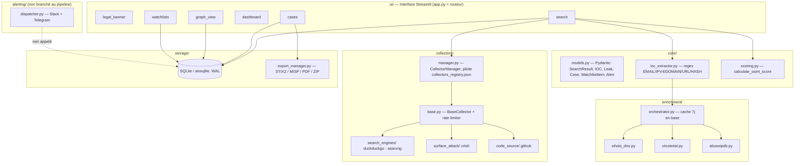
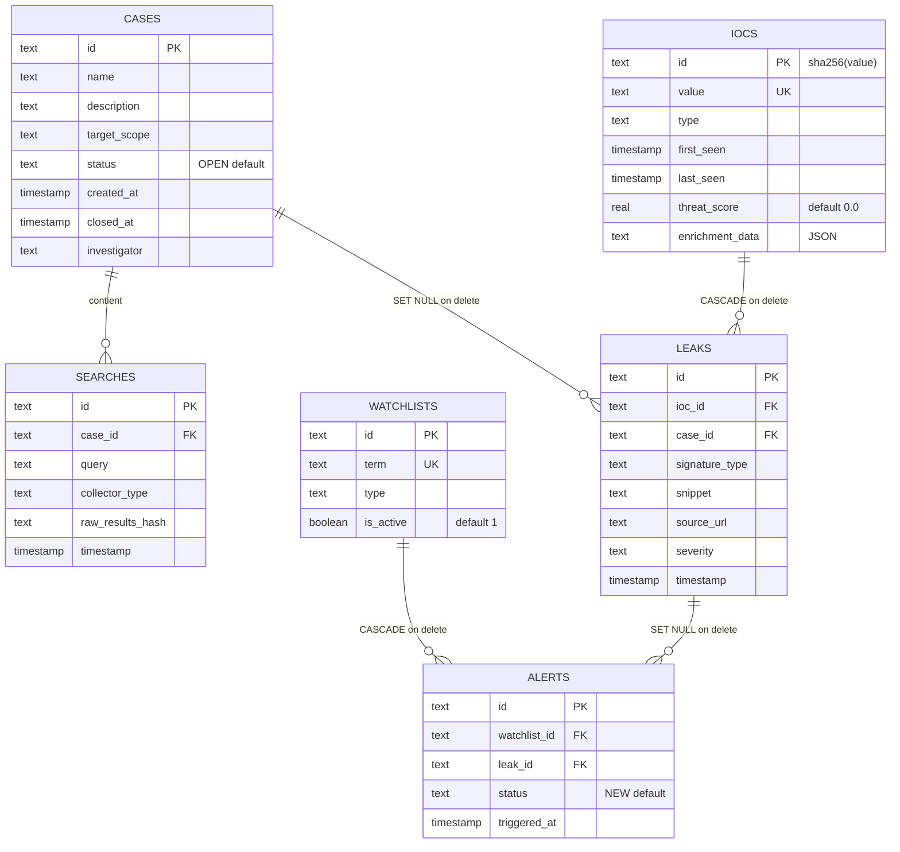

# 🕵️‍♂️ Dorker Pro — OSINT Command Center v6.0

**Venona** est une plateforme OSINT modulaire en Python/Streamlit : collecte multi-sources, extraction d'IOC, enrichissement (WHOIS/DNS, VirusTotal, AbuseIPDB), gestion de cas avec traçabilité (chain of custody), graphe d'entités, watchlists et exports (STIX 2.1, MISP, PDF, bundle ZIP).

> Ce guide a été rédigé à partir du **code source réel** du dépôt (et non de sa seule description) pour permettre à quelqu'un qui découvre le projet de l'installer, comprendre son fonctionnement actuel — y compris ses limites connues — et lancer sa première investigation.

---

## ⚠️ Avertissement légal et éthique (strict)

Repris de l'application elle-même (`ui/legal_banner.py`), affiché à chaque session et dont l'acceptation est tracée en session :

Cet outil est conçu **exclusivement** pour :
- la cyberdéfense (Blue Team, CERT, analyse d'incident) ;
- des tests d'intrusion **autorisés** (Red Team, Bug Bounty dans le scope) ;
- de la veille sur des données **publiquement accessibles** (OSINT passif).

**Interdit** : accès non autorisé à des systèmes/comptes/données privées, automatisation d'attaques, harcèlement, ingénierie sociale. L'utilisateur reste seul responsable de la conformité légale de ses actions (RGPD, CFAA, Loi Informatique et Libertés…).

---

## 🧭 Sommaire

1. [Ce que fait Venona aujourd'hui](#-ce-que-fait-venona-aujourdhui)
2. [État du projet & limites connues](#-état-du-projet--limites-connues)
3. [Architecture](#-architecture)
4. [Installation](#-installation)
5. [Configuration (.env)](#-configuration-env)
6. [Premier lancement](#-premier-lancement)
7. [Prise en main pas à pas](#-prise-en-main-pas-à-pas--première-investigation)
8. [Collecteurs](#-collecteurs)
9. [Enrichissement des IOC](#-enrichissement-des-ioc)
10. [Scoring](#-scoring)
11. [Modèle de données](#-modèle-de-données)
12. [Exports](#-exports)
13. [Alerting (Slack/Telegram)](#-alerting-slacktelegram)
14. [OPSEC](#-opsec)
15. [Ajouter un collecteur](#-ajouter-un-collecteur)
16. [Structure du dépôt](#-structure-du-dépôt)

---

## 🎯 Ce que fait Venona aujourd'hui

| Module (menu latéral) | Fichier | Rôle réel |
|---|---|---|
| 🔍 Recherche OSINT | `ui/search.py` | Lance les collecteurs sélectionnés, extrait les IOC par regex, enrichit (optionnel), calcule un score, journalise la recherche et sauvegarde les IOC |
| 📊 Centre de Commandement | `ui/dashboard.py` | 4 métriques globales (cas ouverts, IOC totaux, fuites critiques, alertes) ; sections "activité récente" encore en placeholder |
| 📁 Gestion des Cas | `ui/cases.py` | Création de cas, liste des cas, vue des IOC liés, exports par cas, ouverture/fermeture/archivage |
| 🕸️ Graphe d'Entités | `ui/graph_view.py` | Graphe interactif (`pyvis`) des IOC connus, avec liaison automatique `email → domaine` |
| 📡 Watchlists & Alertes | `ui/watchlists.py` | Ajout de termes à surveiller, liste des alertes (déclenchement automatique **pas encore branché**, voir plus bas) |
| ⚙️ Configuration | `app.py` | Rappel des chemins de config + bouton de vérification OPSEC (IP perçue / proxy actif) |

---

## 🚧 État du projet & limites connues

Le code étant lu directement, voici les points à connaître **avant** de suivre le tutoriel, pour ne pas être surpris :

1. **Le lien Recherche → Cas actif n'est pas encore branché dans l'UI.** Rien dans le code ne positionne `st.session_state['active_case_id']` (pas de bouton "activer ce cas"). Résultat : tant que vous n'ajoutez pas ce mécanisme, `ui/search.py` journalise toutes les recherches sous l'identifiant littéral `"demo-case-id"` (valeur par défaut du `.get()`), qui ne correspond à aucun cas réel créé via l'UI.
2. **La liaison IOC ↔ Cas passe par la table `leaks`**, or aucune fonction du pipeline actuel n'appelle `db.save_leak()`. Conséquence concrète : le bouton *"📊 Voir les IOC"* d'un cas (`ui/cases.py`) et le graphe filtré par `case_id` (`ui/graph_view.py`) resteront **vides**, même après une recherche qui a bien extrait des IOC (ceux-ci sont sauvegardés globalement via `save_ioc`, mais pas rattachés à un cas). Pour explorer les IOC extraits aujourd'hui, passez par le graphe **sans filtre de cas** (`case_id=None`), qui liste jusqu'à 100 IOC toutes sources confondues.
3. **Les alertes ne se déclenchent pas encore automatiquement.** `storage/db_manager.create_alert()` et `alerting/dispatcher.py` (Slack/Telegram) existent et fonctionnent isolément, mais rien ne les appelle depuis le pipeline de recherche ou une tâche planifiée — l'onglet "Historique des alertes" restera vide en usage normal.
4. **4 collecteurs actifs/déclarables** (`duckduckgo_html`, `searxng_public`, `crtsh_passive`, `github_code`) sont réellement implémentés et présents dans `collectors_registry.json`. Sept autres fichiers (`brave.py`, `qwant.py`, `censys.py`, `shodan.py`, `hibp.py`, `gitlab.py`, `rss.py`) existent mais sont des stubs `# TODO` non enregistrés — un bon point d'entrée si vous voulez contribuer.
5. **Les tests (`tests/*.py`) sont des placeholders** (`# TODO: ...`), pas encore implémentés.
6. **Aucun `.env.example` n'est fourni dans le dépôt** — créez votre `.env` à partir de la section [Configuration](#-configuration-env) ci-dessous.

Rien de tout cela n'empêche de faire fonctionner l'outil : la boucle *recherche → extraction IOC → enrichissement → scoring → stockage global* fonctionne de bout en bout dès l'installation. Ce sont surtout les vues **filtrées par cas** qui sont pour l'instant déconnectées du pipeline de recherche.

---

## 🏗️ Architecture



Points d'architecture réels :
- **`collectors_registry.json`** pilote dynamiquement les sources chargées par `CollectorManager` — ajouter une source ne demande **pas** de modifier `app.py` ou `ui/search.py`.
- **`BaseCollector._respect_rate_limit()`** attend `60 / requests_per_minute` secondes entre deux appels d'un même collecteur (pas de backoff exponentiel réel dans le code actuel malgré la mention au changelog — c'est un simple throttle par intervalle fixe).
- **Chain of custody** : `DatabaseManager.log_search()` hash en SHA-256 (`raw_results_hash`) le JSON brut des résultats de chaque recherche.
- **Cache d'enrichissement** : `EnrichmentOrchestrator` relit `iocs.enrichment_data` et ne relance un appel API que si la dernière donnée a plus de 7 jours.

---

## 📦 Installation

```bash
git clone https://github.com/KareyPyer/Venona.git
cd Venona

python3 -m venv .venv
source .venv/bin/activate      # Windows : .venv\Scripts\activate

pip install -r requirements.txt
```

---

## 🔐 Configuration (.env)

Il n'y a pas de `.env.example` dans le dépôt : créez le fichier `.env` à la racine avec, au minimum :

```bash
# --- Base de données SQLite ---
OSINT_DB_PATH=osint_searches.db

# --- OPSEC : proxy sortant (recommandé, ex. Tor local) ---
HTTP_PROXY=socks5h://127.0.0.1:9050
HTTPS_PROXY=socks5h://127.0.0.1:9050

# --- Active le collecteur github_code (désactivé sinon) ---
GITHUB_TOKEN=ghp_xxx...

# --- Clés d'enrichissement optionnelles, lues dans ui/search.py ---
VIRUSTOTAL_API_KEY=
ABUSEIPDB_API_KEY=

# --- Alerting (fonctionnel isolément, non branché au pipeline — voir plus haut) ---
SLACK_WEBHOOK_URL=
TELEGRAM_BOT_TOKEN=
TELEGRAM_CHAT_ID=
```

> `collectors/manager.py` ne charge un collecteur marqué `"requires_api_key": true` que si la variable d'environnement indiquée dans `env_var` est définie et non vide — c'est le cas de `github_code` avec `GITHUB_TOKEN`.

---

## 🚀 Premier lancement

```bash
python init_db.py
streamlit run app.py
```

`init_db.py` est idempotent (`CREATE TABLE IF NOT EXISTS`) et **insère un cas de démo si la base est vide** :

```
[*] Insertion des données de démonstration...
[SUCCESS] Initialisation terminée avec succès !
```

Ce jeu de données crée : un cas *"Cas Démo : Veille de Marque"* (scope `*.exemple-cible.com, admin@exemple-cible.com`), un IOC `admin@exemple-cible.com` (type `EMAIL`, `threat_score` 0.65), une recherche associée et une entrée watchlist sur `exemple-cible.com`. **Aucune fuite (`leaks`) n'est seedée** — cohérent avec la limite n°2 ci-dessus : même le cas de démo affichera "aucun IOC associé" dans l'onglet *Voir les IOC*.

L'app s'ouvre sur `http://localhost:8501`.

---

## 🧪 Prise en main pas à pas — Première investigation

### 1. Bannière légale
Cochez la case de la barre latérale (*"Je certifie utiliser cet outil dans un cadre légal et autorisé"*) — obligatoire, l'app s'arrête sinon (`st.stop()`).

### 2. Créer un cas (optionnel pour tester la recherche, cf. limite n°1)
Menu **📁 Gestion des Cas** → onglet *Nouveau Cas* :

| Champ | Exemple |
|---|---|
| Nom du cas * | `Audit OSINT — Domaine client` |
| Description | `Cartographie de l'exposition publique avant pentest autorisé` |
| Périmètre autorisé * | `*.exemple-cible.com, admin@exemple-cible.com` |
| Investigateur | `Pyer` |

### 3. Lancer une recherche OSINT
Menu **🔍 Recherche OSINT**. Le champ requête a pour placeholder :

```text
@target.com OR site:pastebin.com target
```

Exemples de requêtes à essayer avec les 3 collecteurs actifs par défaut (`duckduckgo_html`, `searxng_public`) :

```text
site:exemple-cible.com filetype:pdf confidentiel
"@exemple-cible.com" password
exemple-cible.com
```

Pour cartographier des sous-domaines via Certificate Transparency, sélectionnez le collecteur `crtsh_passive` et entrez simplement le domaine nu :

```text
exemple-cible.com
```

Cochez **🔬 Activer l'enrichissement automatique** pour déclencher WHOIS/DNS (domaines), VirusTotal + AbuseIPDB (IP, si clés renseignées) et une vérification MX (emails).

Cliquez **🚀 Lancer l'Investigation**. Le résultat affiche `Score`, nombre d'IOC extraits et un ID de recherche tronqué, puis 3 onglets : **Résultats** (20 premiers), **IOC** (tableau type/valeur/confiance/enrichi), **Analyse** (score + résumé).

### 4. Explorer les IOC extraits
Comme expliqué en limite n°2, passez par le **Graphe d'Entités** sans filtre de cas pour voir les IOC réellement enregistrés en base (`ui/cases.py` ne les affichera pas tant qu'ils ne sont pas rattachés via `leaks`).

### 5. Graphe d'Entités
Menu **🕸️ Graphe d'Entités** → **🔄 Générer le graphe**. Sans cas actif sélectionné, la requête est `SELECT value, type FROM iocs LIMIT 100` : vous verrez donc tous les IOC extraits par vos recherches précédentes, avec un lien automatique `email → domaine` quand le domaine de l'email est aussi présent comme nœud `DOMAIN`. Code couleur : `EMAIL` vert, `IPV4` cyan, `DOMAIN` orange, `URL` magenta, hashs en jaune.

### 6. Watchlist
Menu **📡 Watchlists & Alertes** → onglet *Ajouter une cible* :

```text
Terme : exemple-cible.com
Type  : DOMAIN
```

L'onglet *Historique des alertes* restera vide tant que le déclenchement automatique n'est pas implémenté (limite n°3) — c'est une bonne première contribution si le sujet vous intéresse.

### 7. Vérifier son OPSEC
Menu **⚙️ Configuration** → **🔍 Vérifier mon anonymat** : appelle `api.ipify.org` pour afficher l'IP perçue, et indique si `HTTP_PROXY`/`HTTPS_PROXY` est positionné dans l'environnement. Ne confirme pas activement que le trafic **transite** par le proxy — juste que la variable existe.

### 8. Exporter
Menu **📁 Gestion des Cas** → dépliez un cas → section *Exports* : boutons **STIX 2.1**, **MISP**, **PDF**, **ZIP Bundle** (les 4 en un seul zip avec `manifest.json`). Ces exports utilisent `get_iocs_for_case()`, donc là encore, tant que la limite n°2 n'est pas levée, ils partiront vides pour un cas fraîchement créé.

---

## 🔌 Collecteurs

| ID | Source | Catégorie | API requise | Enregistré / activé par défaut |
|---|---|---|---|---|
| `duckduckgo_html` | DuckDuckGo (scraping HTML + rotation `fake-useragent`) | `search_engine` | Non | ✅ |
| `searxng_public` | Instance publique `searx.be`, résultats JSON | `search_engine` | Non | ✅ |
| `crtsh_passive` | crt.sh (Certificate Transparency, jusqu'à 50 certificats) | `surface_attack` | Non | ✅ |
| `github_code` | GitHub Code Search API | `code_source` | Oui (`GITHUB_TOKEN`) | ❌ (désactivé sans token) |

**Stubs non enregistrés** (fichier présent, contenu `# TODO`, absents de `collectors_registry.json`) : `brave.py`, `qwant.py`, `censys.py`, `shodan.py`, `hibp.py` (breach_intel), `gitlab.py`, `rss.py` (passive_feed).

Chaque collecteur hérite de `BaseCollector` et respecte son `rate_limit.requests_per_minute` déclaré dans le registre.

---

## 🧬 Enrichissement des IOC

`enrichment/orchestrator.py` route selon le type d'IOC :

| Type IOC | Enrichissement appliqué |
|---|---|
| `DOMAIN` | WHOIS (registrar, dates, name servers, org, pays) + DNS (A, MX, TXT) via `whois_dns.py` ; + VirusTotal si `VIRUSTOTAL_API_KEY` défini |
| `IPV4` | AbuseIPDB (score d'abus, ISP, pays, nb. de signalements) si `ABUSEIPDB_API_KEY` défini ; + VirusTotal si clé présente |
| `EMAIL` | Vérification de l'existence d'un enregistrement MX pour le domaine |
| `URL`, `HASH_*` | Aucun enrichissement implémenté actuellement |

Le résultat est mis en cache **7 jours** dans `iocs.enrichment_data` (JSON) avant toute nouvelle requête API — utile pour ménager des quotas gratuits.

---

## 📈 Scoring

L'algorithme réellement utilisé (`core/scoring.py`, fonction `calculate_osint_score`) est une somme pondérée par type d'IOC, plus un bonus par fuite :

| Type IOC | Poids |
|---|---|
| `HASH_MD5` / `HASH_SHA256` | 3.0 |
| `IPV4` | 1.5 |
| `DOMAIN` | 1.2 |
| `EMAIL` | 1.0 |
| `URL` | 0.8 |
| autre | 0.5 |
| **par fuite (`leaks_count`)** | **+5.0** |

Exemple : une recherche qui remonte 2 emails, 1 domaine et 3 sous-domaines (traités comme `DOMAIN`) donne un score de `2×1.0 + 4×1.2 = 6.8` (le bonus fuite reste à 0 tant que `leaks_count` n'est pas alimenté, cf. limite n°2). Le modèle "Sévérité × Confiance × Fraîcheur" mentionné dans `CHANGELOG.md` décrit l'intention de la v6.0 mais n'est pas ce qui est implémenté dans `scoring.py` à ce jour.

---

## 🗄️ Modèle de données

Schéma réel (`init_db.py`), SQLite en mode `WAL`, `PRAGMA foreign_keys = ON` :



Index créés : `idx_iocs_value`, `idx_iocs_type`, `idx_leaks_case_id`, `idx_leaks_severity`, `idx_alerts_status`, `idx_searches_case_id`.

---

## 📤 Exports

`storage/export_manager.py` (`ExportManager`), tous accessibles depuis l'onglet *Exports* d'un cas dans **📁 Gestion des Cas** :

| Format | Méthode | Détail |
|---|---|---|
| STIX 2.1 | `export_stix21()` | Bundle avec `Identity` "Dorker Pro OSINT", marquage `TLP:WHITE`, un `Indicator` par IOC (`domain-name`, `ipv4-addr`, `email-addr`, `url`) |
| MISP | `export_misp()` | Événement JSON MISP (`threat_level_id=2` Medium, `analysis=1` Ongoing, `distribution=1` Community) |
| PDF | `export_pdf_report()` | Rapport synthétique via `reportlab` : en-tête, hash d'intégrité SHA-256 du cas, résumé, liste des 20 premiers IOC |
| ZIP | `export_bundle_zip()` | Combine les 3 exports ci-dessus + un dump JSON brut + un `manifest.json`, dans un seul `.zip` |

---

## 🔔 Alerting (Slack/Telegram)

`alerting/dispatcher.py` (`AlertDispatcher`) sait envoyer une alerte formatée vers un webhook Slack et/ou un bot Telegram (`SLACK_WEBHOOK_URL`, `TELEGRAM_BOT_TOKEN` + `TELEGRAM_CHAT_ID`), avec un code couleur selon la sévérité. **Ce dispatcher n'est actuellement instancié nulle part dans l'application** — pour l'activer, il faut l'appeler depuis le pipeline de recherche (ou une tâche planifiée) après une détection de fuite. Notez aussi un `NameError` latent : `send_alert()` utilise `asyncio.gather` sans importer le module `asyncio` en tête de fichier.

---

## 🛡️ OPSEC

- `utils/opsec.check_ip_leak()` interroge `api.ipify.org` pour afficher l'IP perçue et indiquer si `HTTP_PROXY`/`HTTPS_PROXY` est défini dans l'environnement (accessible via **⚙️ Configuration**).
- `BaseCollector._respect_rate_limit()` limite le débit sortant par collecteur selon `rate_limit.requests_per_minute`.
- `fake-useragent` fait tourner le User-Agent du collecteur DuckDuckGo pour limiter l'empreinte laissée.
- Rappel : les modules OSINT actif (dark web, réseaux sociaux fermés) ne sont pas implémentés dans ce dépôt ; tout ajout de ce type reste soumis à l'avertissement légal en tête de ce document.

---

## ➕ Ajouter un collecteur

1. Implémenter la classe dans `collectors/<categorie>/<nom>.py`, héritant de `BaseCollector` et de sa méthode async `collect(query, session)`.
2. Déclarer la source dans `collectors_registry.json` :

```json
{
  "id": "mon_nouveau_collecteur",
  "name": "Ma Source",
  "category": "search_engine",
  "module": "collectors.search_engines.ma_source",
  "class": "MaSourceCollector",
  "enabled": true,
  "rate_limit": { "requests_per_minute": 15 },
  "requires_api_key": false
}
```

3. Relancer l'app : `CollectorManager._load_collectors()` charge dynamiquement le module via `importlib`, la source apparaît dans le multiselect de **🔍 Recherche OSINT** sans autre modification.

C'est aussi la manière la plus directe de transformer un des stubs `# TODO` existants (`brave.py`, `qwant.py`, `hibp.py`…) en collecteur fonctionnel.

---

## 🗂️ Structure du dépôt

```
Venona/
├── alerting/
│   ├── dispatcher.py        # Slack + Telegram (fonctionnel, non branché)
│   ├── telegram.py          # TODO stub
│   └── webhook.py           # TODO stub
├── collectors/
│   ├── base.py               # BaseCollector + rate limiter
│   ├── manager.py            # CollectorManager (charge collectors_registry.json)
│   ├── search_engines/       # duckduckgo.py, searxng.py (impl.) · brave.py, qwant.py (TODO)
│   ├── surface_attack/       # crtsh.py (impl.) · shodan.py, censys.py (TODO)
│   ├── code_source/          # github.py (impl.) · gitlab.py (TODO)
│   ├── breach_intel/         # hibp.py (TODO)
│   └── passive_feed/         # rss.py (TODO)
├── core/
│   ├── models.py              # Modèles Pydantic
│   ├── ioc_extractor.py       # Extraction regex des IOC
│   └── scoring.py             # calculate_osint_score
├── enrichment/
│   ├── orchestrator.py        # Cache 7j + routage par type d'IOC
│   ├── whois_dns.py
│   ├── virustotal.py
│   └── abuseipdb.py
├── storage/
│   ├── db_manager.py           # DatabaseManager (aiosqlite)
│   └── export_manager.py       # STIX2 / MISP / PDF / ZIP
├── ui/
│   ├── legal_banner.py
│   ├── search.py
│   ├── cases.py
│   ├── dashboard.py
│   ├── graph_view.py
│   ├── watchlists.py
│   └── themes.py               # vide actuellement
├── utils/
│   ├── opsec.py                 # check_ip_leak()
│   ├── rate_limiter.py           # RateLimiter générique (non utilisé par BaseCollector)
│   └── logger.py                 # setup_logger()
├── tests/                        # placeholders TODO (pytest / pytest-asyncio)
├── app.py                         # Point d'entrée Streamlit + routage sidebar
├── init_db.py                     # Init/migration DB, idempotent, seed démo
├── collectors_registry.json       # Registre déclaratif des collecteurs
├── requirements.txt
└── CHANGELOG.md
```

---

## 🗺️ Pistes de contribution naturelles

Vu l'état du code, les gains les plus immédiats pour la suite du projet :

1. Brancher `st.session_state['active_case_id']` (bouton "Activer ce cas" dans `ui/cases.py`) et faire écrire `db.save_leak()` (ou a minima lier l'IOC extrait au cas actif) depuis `ui/search.py`.
2. Appeler `AlertDispatcher` + `db.create_alert()` quand une fuite matche un terme de la watchlist.
3. Implémenter un des collecteurs stub (HIBP serait un bon complément naturel à l'enrichissement email existant).
4. Écrire les tests dans `tests/` (`pytest-asyncio` est déjà en dépendance).

Voir [`CHANGELOG.md`](./CHANGELOG.md) pour l'historique de la v6.0.
