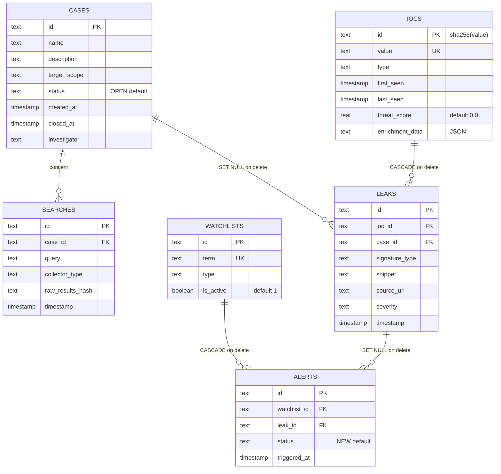

# 🕵️‍♂️ Dorker Pro — OSINT Command Center v6.0 (patch v6.1 fusionné)

**Venona** est une plateforme OSINT modulaire en Python/Streamlit : collecte multi-sources (moteurs de recherche, threat intel, breach intel, flux passifs, surface d'attaque, code source), scraping optionnel du contenu des pages, extraction d'IOC avancée (16 types, validation par entropie), enrichissement (WHOIS/DNS, VirusTotal, AbuseIPDB), gestion de cas avec traçabilité (chain of custody), graphe d'entités, watchlists et exports (STIX 2.1, MISP, PDF, bundle ZIP).

> Ce guide a été rédigé à partir du **code source réel** du dépôt (et non de sa seule description) pour permettre à quelqu'un qui découvre le projet de l'installer, comprendre son fonctionnement actuel — y compris ses limites connues — et lancer sa première investigation. Le dépôt contenait un `README_PATCH.md` (v6.1) décrivant des correctifs et de nouveaux collecteurs ; **ce patch est déjà intégré dans le code actuel** (registre, collecteurs, scoring, extraction, UI), c'est pourquoi ce document ne décrit qu'un seul état, à jour.

---

## ⚠️ Avertissement légal et éthique (strict)

Repris de l'application elle-même (`ui/legal_banner.py`), affiché à chaque session et dont l'acceptation est tracée en session :

Cet outil est conçu **exclusivement** pour :
- la cyberdéfense (Blue Team, CERT, analyse d'incident) ;
- des tests d'intrusion **autorisés** (Red Team, Bug Bounty dans le scope) ;
- de la veille sur des données **publiquement accessibles** (OSINT passif).

**Interdit** : accès non autorisé à des systèmes/comptes/données privées, automatisation d'attaques, harcèlement, ingénierie sociale. L'utilisateur reste seul responsable de la conformité légale de ses actions (RGPD, CFAA, Loi Informatique et Libertés…).

---

## 🧭 Sommaire

1. [Ce que fait Venona aujourd'hui](#-ce-que-fait-venona-aujourdhui)
2. [Nouveautés du patch v6.1 déjà en place](#-nouveautés-du-patch-v61-déjà-en-place)
3. [État du projet & limites connues](#-état-du-projet--limites-connues)
4. [Architecture](#-architecture)
5. [Installation](#-installation)
6. [Configuration (.env)](#-configuration-env)
7. [Premier lancement](#-premier-lancement)
8. [Prise en main pas à pas](#-prise-en-main-pas-à-pas--première-investigation)
9. [Collecteurs](#-collecteurs)
10. [Traduction & nettoyage des requêtes par moteur](#-traduction--nettoyage-des-requêtes-par-moteur)
11. [Scraping de contenu](#-scraping-de-contenu)
12. [Extraction d'IOC](#-extraction-dioc)
13. [Enrichissement des IOC](#-enrichissement-des-ioc)
14. [Scoring](#-scoring)
15. [Modèle de données](#-modèle-de-données)
16. [Exports](#-exports)
17. [Alerting (Slack/Telegram)](#-alerting-slacktelegram)
18. [OPSEC](#-opsec)
19. [Ajouter un collecteur](#-ajouter-un-collecteur)
20. [Structure du dépôt](#-structure-du-dépôt)
21. [Pistes de contribution naturelles](#-pistes-de-contribution-naturelles)

---

## 🎯 Ce que fait Venona aujourd'hui

| Module (menu latéral) | Fichier | Rôle réel |
|---|---|---|
| 🔍 Recherche OSINT | `ui/search.py` | Lance les collecteurs sélectionnés (avec traduction de requête par moteur), scrape en option le contenu des pages trouvées, extrait les IOC (snippets + contenu réel), enrichit (optionnel), calcule un score v2, journalise la recherche, sauvegarde les IOC et **les rattache au cas actif via `leaks`** si un cas est activé |
| 📊 Centre de Commandement | `ui/dashboard.py` | 4 métriques globales (cas ouverts, IOC totaux, fuites critiques, alertes) ; sections "activité récente" et "carte géographique" encore en placeholder |
| 📁 Gestion des Cas | `ui/cases.py` | Création de cas, liste des cas avec **bouton "Activer ce cas"**, vue des IOC réellement liés au cas actif, exports par cas, ouverture/fermeture/archivage, timeline des recherches d'un cas actif |
| 🕸️ Graphe d'Entités | `ui/graph_view.py` | Graphe interactif (`pyvis`) des IOC connus (filtré par cas actif si un cas est sélectionné, sinon global), avec liaison automatique `email → domaine` |
| 📡 Watchlists & Alertes | `ui/watchlists.py` | Ajout de termes à surveiller, liste des alertes (déclenchement automatique **toujours pas branché**, voir plus bas) |
| ⚙️ Configuration | `app.py` | Rappel des chemins de config + bouton de vérification OPSEC (IP perçue / proxy actif) |

---

## 🆕 Nouveautés du patch v6.1 déjà en place

Le `README_PATCH.md` présent dans le dépôt décrit un patch d'amélioration ; en lisant le code, il est **déjà appliqué**. Concrètement, par rapport à une v6.0 "brute" :

- **Lien Recherche → Cas fonctionnel.** `ui/search.py` crée désormais un `Leak` (`db.save_leak()`) pour chaque IOC extrait dès qu'un cas actif est sélectionné (`case_id != "demo-case-id"`). Le bouton **"▶️ Activer ce cas"** existe dans `ui/cases.py` et positionne `st.session_state['active_case_id']`. Résultat : la vue *"📊 Voir les IOC"* d'un cas et le graphe filtré par cas se peuplent réellement après une recherche menée avec ce cas actif.
- **8 nouveaux collecteurs implémentés et enregistrés** (contre 4 stubs `# TODO` en v6.0) : `alienvault_otx`, `greynoise`, `malwarebazaar`, `urlscan`, `hibp`, `rss_feeds`, `shodan`, `censys` — voir [Collecteurs](#-collecteurs).
- **Extraction d'IOC v2** (`core/ioc_extractor.py`) : 16 types reconnus (au lieu de 5), validation des hashes par entropie de Shannon, filtrage des IP privées, filtrage d'une **whitelist de domaines légitimes** (vendors sécurité, CERT, médias tech, ONG OSINT) pour éviter de remonter `virustotal.com` ou `cisa.gov` comme IOC, détection des domaines à TLD suspect.
- **Scoring v2** (`core/scoring.py`) : pondération par type d'IOC élargie (jusqu'à des clés AWS, tokens GitHub, clés privées, règles YARA…), bonus ×1.5 si TLD suspect, bonus ×1.3 si l'IOC a été enrichi, bonus fixe de +8.0 par fuite (`leaks_count`), score plafonné à 100. C'est le modèle "Sévérité × Confiance × Fiabilité source" annoncé par le `CHANGELOG.md` — qui, lui, n'a pas été mis à jour au-delà de la version 6.0.0 et ne mentionne donc pas ce patch.
- **Scraping de contenu des pages** (`collectors/content_scraper.py`, nouveau module) : au-delà des snippets renvoyés par les moteurs, l'app peut télécharger et nettoyer le texte des pages trouvées pour y extraire des IOC supplémentaires (hashes, domaines C2 mentionnés dans un article, etc.).
- **Traduction/nettoyage de requêtes par moteur** (`core/dork_translator.py`, `core/query_sanitizer.py`) : les Google Dorks saisis sont adaptés (ou dégradés proprement, avec avertissement) selon les capacités réelles de chaque moteur avant l'envoi.
- **`alerting/dispatcher.py` corrigé** : `import asyncio` est bien présent en tête de fichier (le `NameError` documenté dans une version antérieure du README n'existe plus). Le dispatcher reste néanmoins non appelé depuis le pipeline (voir limites ci-dessous).
- **`collectors_registry.json` complet** : passe de 4 à 12 entrées, toutes marquées `"enabled": true` (celles qui exigent une clé API restent simplement non chargées tant que la variable d'environnement correspondante est absente).

---

## 🚧 État du projet & limites connues

Le code étant lu directement, voici les points à connaître **avant** de suivre le tutoriel, pour ne pas être surpris :

1. **Les alertes ne se déclenchent toujours pas automatiquement.** `storage/db_manager.create_alert()` et `alerting/dispatcher.py` (Slack/Telegram, désormais sans bug d'import) existent et fonctionnent isolément, mais **`AlertDispatcher` n'est instancié nulle part ailleurs dans le code** — ni dans le pipeline de recherche, ni dans une tâche planifiée. L'onglet *Historique des alertes* restera vide en usage normal, et les boutons "Marquer comme vue" / "Résoudre" / "Faux positif" de `ui/watchlists.py` affichent juste `st.info("Fonction à implémenter")`.
2. **Le score affiché après une recherche ne compte jamais le bonus de fuite.** `run_osint_pipeline()` appelle `calculate_osint_score(iocs, source_reliability=1.2)` sans passer `leaks_count`, qui vaut alors 0 par défaut — même quand des `Leak` viennent d'être créés dans la foulée pour le cas actif. Le bonus "+8.0 par fuite" documenté plus haut n'a donc d'effet nulle part dans le flux actuel.
3. **Sur les 12 collecteurs déclarés dans `collectors_registry.json`, 8 exigent une clé API** (`github_code`, `greynoise`, `urlscan`, `hibp`, `shodan`, `censys` — et `censys` vérifie en réalité deux variables, `CENSYS_API_ID` et `CENSYS_API_SECRET`, alors que le registre ne référence que `CENSYS_API_ID` via `env_var`). Sans ces clés, `CollectorManager._load_collectors()` les ignore silencieusement (log `INFO` uniquement) : par défaut, avec un `.env` minimal, seuls `duckduckgo_html`, `searxng_public`, `crtsh_passive`, `alienvault_otx`, `malwarebazaar` et `rss_feeds` sont réellement actifs.
4. **Les tests (`tests/*.py`) sont toujours des placeholders** (`# TODO: ...`), malgré `pytest`/`pytest-asyncio` déjà en dépendance.
5. **Aucun `.env.example` n'est fourni dans le dépôt**, bien que `README_PATCH.md` en mentionne un — créez votre `.env` à partir de la section [Configuration](#-configuration-env) ci-dessous.
6. **`BaseCollector._respect_rate_limit()` reste un simple throttle par intervalle fixe** (`60 / requests_per_minute` secondes d'attente entre deux appels), malgré la mention d'un "rate limiter avec backoff exponentiel" dans `CHANGELOG.md`. Un `utils/rate_limiter.py` générique existe avec la même logique simple, mais n'est utilisé par aucun collecteur.
7. **`core/dork_templates.py` (templates de requêtes par type d'investigation : hash de malware, infra C2, email compromis, acteur de menace, CVE, reconnaissance de domaine/IP) existe et fonctionne, mais n'est appelé par aucune vue `ui/`** — c'est une bibliothèque prête à l'emploi, pas encore exposée dans l'interface.
8. **`ui/themes.py` est toujours vide** (`# TODO: CSS themes manager`).
9. Deux fichiers à la racine, `Instances SearNGX.txt` et `ifos_gitignore.txt`, sont des notes/aides et non du code exécuté : le premier liste des instances SearXNG alternatives à copier manuellement dans `collectors_registry.json` en cas d'indisponibilité de l'instance par défaut ; le second est un modèle de `.gitignore` à renommer si besoin (il n'est pas actif tel quel).

Rien de tout cela n'empêche de faire fonctionner l'outil : la boucle *recherche → extraction IOC → enrichissement → scoring → stockage → rattachement au cas actif* fonctionne de bout en bout dès l'installation, à condition d'activer un cas avant de lancer une recherche.

---

## 🏗️ Architecture

```mermaid
flowchart TB
    subgraph UI["ui/ — Interface Streamlit (app.py = routeur)"]
        A1[legal_banner]
        A2[search]
        A3[cases]
        A4[dashboard]
        A5[graph_view]
        A6[watchlists]
    end

    subgraph CORE["core/"]
        B1[models.py — Pydantic: SearchResult, IOC, Leak, Case, WatchlistItem, Alert]
        B2[ioc_extractor.py — 16 types, entropie, whitelist domaines]
        B3[scoring.py — calculate_osint_score v2]
        B4[dork_translator.py + query_sanitizer.py]
        B5[dork_templates.py — non branché à l'UI]
        B6[domain_whitelist.py]
    end

    subgraph COLLECT["collectors/"]
        C0[base.py — BaseCollector + rate limiter simple]
        C1[manager.py — CollectorManager, pilote collectors_registry.json]
        C2[search_engines/ duckduckgo · searxng]
        C3[surface_attack/ crtsh · shodan · censys]
        C4[code_source/ github]
        C5[threat_intel/ otx · greynoise · malwarebazaar · urlscan]
        C6[breach_intel/ hibp]
        C7[passive_feed/ rss]
        C8[content_scraper.py — scraping du texte des pages]
    end

    subgraph ENRICH["enrichment/"]
        D1[orchestrator.py — cache 7j en base]
        D2[whois_dns.py]
        D3[virustotal.py]
        D4[abuseipdb.py]
    end

    subgraph STORAGE["storage/"]
        E1[(SQLite / aiosqlite, WAL)]
        E2[export_manager.py — STIX2 / MISP / PDF / ZIP]
    end

    subgraph ALERT["alerting/ (non branché au pipeline)"]
        F1[dispatcher.py — Slack + Telegram]
    end

    A2 --> C1
    C1 --> C0
    C0 --> C2 & C3 & C4 & C5 & C6 & C7
    A2 --> C8
    A2 --> B4
    B4 --> B6
    A2 --> B2
    B2 --> D1
    D1 --> D2 & D3 & D4
    A2 --> B3
    A2 --> E1
    A3 --> E1
    A3 --> E2
    A5 --> E1
    A6 --> E1
    F1 -.non appelé.-> E1
```



Points d'architecture réels :
- **`collectors_registry.json`** pilote dynamiquement les sources chargées par `CollectorManager` — ajouter une source ne demande **pas** de modifier `app.py` ou `ui/search.py`.
- **`BaseCollector._respect_rate_limit()`** attend `60 / requests_per_minute` secondes entre deux appels d'un même collecteur (throttle par intervalle fixe, pas de backoff exponentiel réel malgré la mention au changelog).
- **Chain of custody** : `DatabaseManager.log_search()` hash en SHA-256 (`raw_results_hash`) le JSON brut des résultats de chaque recherche.
- **Cache d'enrichissement** : `EnrichmentOrchestrator` relit `iocs.enrichment_data` et ne relance un appel API que si la dernière donnée a plus de 7 jours.
- **Rattachement au cas** : `run_osint_pipeline()` crée un `Leak` par IOC extrait dès qu'un cas actif (autre que le cas démo) est sélectionné, ce qui alimente `get_iocs_for_case()`, le graphe filtré et les exports par cas.

---

## 📦 Installation

```bash
git clone https://github.com/KareyPyer/Venona.git
cd Venona

python3 -m venv .venv
source .venv/bin/activate      # Windows : .venv\Scripts\activate

pip install -r requirements.txt
```

---

## 🔐 Configuration (.env)

Il n'y a pas de `.env.example` dans le dépôt : créez le fichier `.env` à la racine avec, au minimum :

```bash
# --- Base de données SQLite ---
OSINT_DB_PATH=osint_searches.db

# --- OPSEC : proxy sortant (recommandé, ex. Tor local) ---
HTTP_PROXY=socks5h://127.0.0.1:9050
HTTPS_PROXY=socks5h://127.0.0.1:9050

# --- Active le collecteur github_code (désactivé sinon) ---
GITHUB_TOKEN=ghp_xxx...

# --- Clés d'enrichissement optionnelles, lues dans ui/search.py ---
VIRUSTOTAL_API_KEY=
ABUSEIPDB_API_KEY=

# --- Clés des nouveaux collecteurs threat/breach/surface intel (patch v6.1) ---
GRY_API_KEY=            # GreyNoise
URLSCAN_API_KEY=        # URLScan.io (optionnelle, plus de résultats si renseignée)
HIBP_API_KEY=           # Have I Been Pwned (payant, ~3€/mois)
SHODAN_API_KEY=         # Shodan
CENSYS_API_ID=          # Censys — nécessite AUSSI CENSYS_API_SECRET (non déclaré dans le registre)
CENSYS_API_SECRET=      # Censys

# --- Alerting (fonctionnel isolément, non branché au pipeline — voir plus haut) ---
SLACK_WEBHOOK_URL=
TELEGRAM_BOT_TOKEN=
TELEGRAM_CHAT_ID=
```

> `collectors/manager.py` ne charge un collecteur marqué `"requires_api_key": true` que si la variable d'environnement indiquée dans `env_var` est définie et non vide. `alienvault_otx`, `malwarebazaar` et `rss_feeds` ne demandent aucune clé et sont donc actifs dès l'installation, comme `duckduckgo_html`, `searxng_public` et `crtsh_passive`.
> ⚠️ **Censys est un cas particulier** : le collecteur (`collectors/surface_attack/censys.py`) vérifie `CENSYS_API_ID` **et** `CENSYS_API_SECRET`, mais `collectors_registry.json` ne déclare que `CENSYS_API_ID` comme `env_var`. Si vous ne définissez que `CENSYS_API_ID`, le collecteur sera chargé par `CollectorManager` mais échouera silencieusement (retour `[]`) faute de secret.

---

## 🚀 Premier lancement

```bash
python init_db.py
streamlit run app.py
```

`init_db.py` est idempotent (`CREATE TABLE IF NOT EXISTS`) et **insère un cas de démo si la base est vide** :

```
[*] Insertion des données de démonstration...
[SUCCESS] Initialisation terminée avec succès !
```

Ce jeu de données crée : un cas *"Cas Démo : Veille de Marque"* (scope `*.exemple-cible.com, admin@exemple-cible.com`), un IOC `admin@exemple-cible.com` (type `EMAIL`, `threat_score` 0.65), une recherche associée et une entrée watchlist sur `exemple-cible.com`. **Aucune fuite (`leaks`) n'est seedée** pour ce cas démo : même après l'installation, son onglet *Voir les IOC* affichera "aucun IOC associé" tant que vous n'y menez pas vous-même une recherche avec ce cas activé.

L'app s'ouvre sur `http://localhost:8501`.

---

## 🧪 Prise en main pas à pas — Première investigation

### 1. Bannière légale
Cochez la case de la barre latérale (*"Je certifie utiliser cet outil dans un cadre légal et autorisé"*) — obligatoire, l'app s'arrête sinon (`st.stop()`).

### 2. Créer un cas et l'activer
Menu **📁 Gestion des Cas** → onglet *Nouveau Cas* :

| Champ | Exemple |
|---|---|
| Nom du cas * | `Audit OSINT — Domaine client` |
| Description | `Cartographie de l'exposition publique avant pentest autorisé` |
| Périmètre autorisé * | `*.exemple-cible.com, admin@exemple-cible.com` |
| Investigateur | `Pyer` |

Puis, dans l'onglet *Liste des Cas*, dépliez le cas créé et cliquez **▶️ Activer ce cas**. Un bandeau `📁 Cas actif : ...` apparaît ensuite dans le module Recherche — c'est ce qui permet de rattacher les IOC extraits au cas via la table `leaks`.

### 3. Lancer une recherche OSINT
Menu **🔍 Recherche OSINT**. Le champ requête accepte des Google Dorks (`site:`, `filetype:`, `OR`, guillemets, parenthèses…) qui sont automatiquement traduits/nettoyés par moteur avant l'envoi (voir [section dédiée](#-traduction--nettoyage-des-requêtes-par-moteur)).

Exemples de requêtes à essayer avec les collecteurs actifs par défaut (`duckduckgo_html`, `searxng_public`, `crtsh_passive`) :

```text
site:exemple-cible.com filetype:pdf confidentiel
"@exemple-cible.com" password
exemple-cible.com
```

Pour cartographier des sous-domaines via Certificate Transparency, sélectionnez `crtsh_passive` et entrez simplement le domaine nu :

```text
exemple-cible.com
```

Dans **⚙️ Options avancées** :
- **🔬 Enrichissement automatique** (VT, AbuseIPDB) — décoché par défaut, consomme des quotas API.
- **📄 Scanner le contenu des pages** — coché par défaut, scrape jusqu'à *N* pages parmi les résultats pour en extraire le texte et y chercher des IOC supplémentaires (voir [Scraping de contenu](#-scraping-de-contenu)).

Cliquez **🚀 Lancer l'Investigation**. Le résultat affiche des statistiques d'extraction (IOC depuis les snippets vs depuis le contenu réel, filtrés comme légitimes ou faux positifs), puis 4 onglets : **Résultats bruts** (20 premiers), **IOC extraits** (groupés par type, avec % de confiance), **Analyse** (score + répartition par type), **Détails techniques** (requêtes traduites envoyées à chaque moteur, pages scrapées).

### 4. Explorer les IOC extraits
Comme un cas est actif, retournez dans **📁 Gestion des Cas** → dépliez le cas → **📊 Voir les IOC** : vous devriez maintenant voir les IOC de la recherche, correctement rattachés via `leaks`.

### 5. Graphe d'Entités
Menu **🕸️ Graphe d'Entités** → **🔄 Générer le graphe**. Si un cas est actif, la requête est filtrée sur ce cas (`JOIN leaks`) ; sinon elle liste jusqu'à 100 IOC toutes sources confondues (`SELECT value, type FROM iocs LIMIT 100`). Code couleur : `EMAIL` vert, `IPV4` cyan, `DOMAIN` orange, `URL` magenta, hashs en jaune.

### 6. Watchlist
Menu **📡 Watchlists & Alertes** → onglet *Ajouter une cible* :

```text
Terme : exemple-cible.com
Type  : DOMAIN
```

L'onglet *Historique des alertes* restera vide tant que le déclenchement automatique n'est pas implémenté (voir [État du projet](#-état-du-projet--limites-connues), point 1) — c'est une bonne première contribution si le sujet vous intéresse.

### 7. Vérifier son OPSEC
Menu **⚙️ Configuration** → **🔍 Vérifier mon anonymat** : appelle `api.ipify.org` pour afficher l'IP perçue, et indique si `HTTP_PROXY`/`HTTPS_PROXY` est positionné dans l'environnement. Ne confirme pas activement que le trafic **transite** par le proxy — juste que la variable existe.

### 8. Exporter
Menu **📁 Gestion des Cas** → dépliez un cas → section *Exports* : boutons **STIX 2.1**, **MISP**, **PDF**, **ZIP Bundle** (les 4 en un seul zip avec `manifest.json`). Ces exports utilisent `get_iocs_for_case()`, donc pour un cas fraîchement créé sans recherche associée, ils partiront vides.

---

## 🔌 Collecteurs

| ID | Source | Catégorie | API requise | Chargé par défaut |
|---|---|---|---|---|
| `duckduckgo_html` | DuckDuckGo (scraping HTML + rotation `fake-useragent`) | `search_engine` | Non | ✅ |
| `searxng_public` | Instance publique `searx.tiekoetter.com` (remplaçable, voir `Instances SearNGX.txt`), résultats JSON | `search_engine` | Non | ✅ |
| `crtsh_passive` | crt.sh (Certificate Transparency, jusqu'à 50 certificats) | `surface_attack` | Non | ✅ |
| `alienvault_otx` | AlienVault OTX — pulses/IOCs communautaires par IP, domaine, hash ou mot-clé | `threat_intel` | Non | ✅ |
| `malwarebazaar` | MalwareBazaar (abuse.ch) — échantillons de malware par hash ou tag | `threat_intel` | Non | ✅ |
| `rss_feeds` | Agrégation de 7 flux RSS sécurité (BleepingComputer, TheHackerNews, DarkReading, ThreatPost, SecurityWeek, KrebsOnSecurity, TheRecord) filtrés par mot-clé | `passive_feed` | Non | ✅ |
| `github_code` | GitHub Code Search API | `code_source` | Oui (`GITHUB_TOKEN`) | ❌ sans token |
| `greynoise` | GreyNoise Community API — IP de scan/bruteforce | `threat_intel` | Oui (`GRY_API_KEY`) | ❌ sans clé |
| `urlscan` | URLScan.io — scans existants par domaine/IP | `threat_intel` | Optionnelle (`URLSCAN_API_KEY`, plus de résultats si fournie) | ❌ sans clé (le registre la marque `requires_api_key: true`) |
| `hibp` | Have I Been Pwned — breaches connues pour un email | `breach_intel` | Oui (`HIBP_API_KEY`, payant) | ❌ sans clé |
| `shodan` | Shodan — hosts/services exposés | `surface_attack` | Oui (`SHODAN_API_KEY`) | ❌ sans clé |
| `censys` | Censys v2 — hosts et certificats | `surface_attack` | Oui (`CENSYS_API_ID` **+** `CENSYS_API_SECRET`, seule la première est déclarée dans le registre) | ❌ sans `CENSYS_API_ID` ; échoue silencieusement si `CENSYS_API_SECRET` manque |

Chaque collecteur hérite de `BaseCollector` et respecte son `rate_limit.requests_per_minute` déclaré dans le registre. Tous renvoient des `SearchResult` homogènes, quel que soit le type de source (recherche web, threat intel, breach, RSS…), ce qui permet à `IOCExtractor` de traiter leurs résultats de façon identique.

---

## 🧭 Traduction & nettoyage des requêtes par moteur

`core/query_sanitizer.py` (`QuerySanitizer`) et `core/dork_translator.py` (`DorkTranslator`) adaptent une requête de type Google Dork à la syntaxe réellement supportée par chaque moteur avant l'envoi :

- Pour `duckduckgo_html` : suppression systématique des guillemets doubles (échecs de parsing en scraping HTML sinon), des opérateurs `OR`/`AND` (interprétés littéralement par DDG), des opérateurs `site:`/`filetype:`/`intitle:`/`inurl:`, et des parenthèses (dont le contenu logique `OR`/`AND` est aplati en une liste de termes).
- Pour `searxng_public` : la syntaxe avancée est conservée ; seules les parenthèses ou guillemets mal formés (nombre impair) sont corrigés.
- `DorkTranslator.ENGINE_CAPABILITIES` déclare aussi les capacités de `brave_search`, `crtsh_passive` et `github_code`, même si `brave_search` n'est pas un ID présent dans `collectors_registry.json` aujourd'hui.

Chaque avertissement (`warnings`) et opérateur perdu (`lost_operators`) est visible dans l'UI via l'expander **"🔧 Aperçu des requêtes traduites par moteur"**, avant même de lancer la recherche. `QuerySanitizer.is_complex_query()` déclenche aussi un bandeau recommandant SearXNG local (Docker) pour les requêtes utilisant `OR`/`AND`/parenthèses/opérateurs avancés.

`core/dork_templates.py` (`DorkTemplates`) fournit par ailleurs 7 familles de requêtes pré-construites (`malware_hash`, `c2_infrastructure`, `breach_email`, `threat_actor`, `vulnerability`, `domain_recon`, `ip_recon`) — utile en Python direct, mais **non exposé dans l'interface Streamlit actuelle**.

---

## 📄 Scraping de contenu

`collectors/content_scraper.py` (`ContentScraper`) va au-delà des snippets renvoyés par les moteurs : pour chaque page trouvée (jusqu'à `max_pages_to_scrape`, réglable de 1 à 20 dans l'UI), il télécharge le HTML, retire les balises non pertinentes (`script`, `style`, `nav`, `header`, `footer`, `aside`, `iframe`, `noscript`) et en extrait le texte brut pour l'extraction d'IOC.

Limites codées en dur :
- Taille max téléchargée : 5 Mo par page.
- Timeout : 15 secondes par requête.
- Domaines ignorés d'office : YouTube, Twitter/X, Facebook, Instagram, LinkedIn, Archive.org.
- Une page dont le texte extrait fait moins de 100 caractères est ignorée (probable page vide ou bloquée).
- Jusqu'à 5 pages scrapées en parallèle (`max_concurrent`), avec rotation de `User-Agent` via `fake-useragent`.

---

## 🧬 Extraction d'IOC

`core/ioc_extractor.py` (`IOCExtractor`) reconnaît **16 types** par regex : `EMAIL`, `IPV4`, `DOMAIN`, `URL`, `HASH_MD5`, `HASH_SHA1`, `HASH_SHA256`, `CVE`, `PHONE`, `IBAN`, `AWS_KEY`, `GITHUB_TOKEN`, `PRIVATE_KEY`, `JWT`, `C2_CONFIG`, `YARA_RULE`, `TLP_MARKER`.

Validations appliquées avant de retenir un IOC :
- **IP privées/loopback** (`10.x`, `127.x`, `172.16–31.x`, `192.168.x`) systématiquement exclues.
- **Hashes** validés par entropie de Shannon (seuils différents pour MD5/SHA1/SHA256) et par exclusion des hashes "vides" connus (chaîne vide en MD5/SHA1/SHA256), pour filtrer les faux positifs de type `000...0`.
- **Domaines** passés dans `core/domain_whitelist.py` (`DomainWhitelist`, si `filter_legitimate=True`, activé par défaut) : vendors de cybersécurité (Kaspersky, ESET, Palo Alto/Unit 42, CrowdStrike, Microsoft, Cisco/Talos, SentinelOne, Mandiant, Check Point, Trend Micro, Zscaler, Recorded Future, VirusTotal, Sophos, Fortinet, BlackBerry, Proofpoint), CERT/agences gouvernementales (ANSSI, CISA, NSA, FBI, NCSC UK, ENISA, MITRE, FIRST, CERT-UA…), médias tech, ONG d'investigation (Bellingcat, DFRLab, OCCRP, ICIJ…) et plateformes légitimes (GitHub, LinkedIn, Wikipedia…) sont exclus.
- **Domaines à TLD suspect** (`.tk`, `.ml`, `.xyz`, `.top`, `.click`…) comptabilisés séparément dans les statistiques d'extraction, sans être exclus.

`IOCExtractor.extract_from_results()` combine les IOC issus des snippets de recherche et, si le scraping de contenu est activé, ceux issus du texte réel des pages, en dédupliquant par valeur.

---

## 🧬 Enrichissement des IOC

`enrichment/orchestrator.py` route selon le type d'IOC :

| Type IOC | Enrichissement appliqué |
|---|---|
| `DOMAIN` | WHOIS (registrar, dates, name servers, org, pays) + DNS (A, MX, TXT) via `whois_dns.py` ; + VirusTotal si `VIRUSTOTAL_API_KEY` défini |
| `IPV4` | AbuseIPDB (score d'abus, ISP, pays, nb. de signalements) si `ABUSEIPDB_API_KEY` défini ; + VirusTotal si clé présente |
| `EMAIL` | Vérification de l'existence d'un enregistrement MX pour le domaine |
| `URL`, `HASH_*`, et les 11 autres types v2 (`CVE`, `PHONE`, `IBAN`, `AWS_KEY`, `GITHUB_TOKEN`, `PRIVATE_KEY`, `JWT`, `C2_CONFIG`, `YARA_RULE`, `TLP_MARKER`) | Aucun enrichissement implémenté actuellement — seuls `DOMAIN`, `IPV4` et `EMAIL` sont routés dans `EnrichmentOrchestrator.enrich()` |

Le résultat est mis en cache **7 jours** dans `iocs.enrichment_data` (JSON) avant toute nouvelle requête API — utile pour ménager des quotas gratuits.

---

## 📈 Scoring

L'algorithme réellement utilisé (`core/scoring.py`, fonction `calculate_osint_score`, "Scoring v2") est une somme pondérée par type d'IOC, avec bonus, plafonnée à 100 :

| Type IOC | Poids de base |
|---|---|
| `HASH_SHA256` / `PRIVATE_KEY` | 5.0 |
| `HASH_SHA1` / `AWS_KEY` | 4.5 |
| `HASH_MD5` / `C2_CONFIG` / `GITHUB_TOKEN` | 4.0 |
| `YARA_RULE` | 3.5 |
| `CVE` / `JWT` | 3.0 |
| `IPV4` | 2.5 |
| `DOMAIN` / `TLP_MARKER` | 2.0 |
| `URL` | 1.5 |
| `EMAIL` | 1.2 |
| `IBAN` | 1.0 |
| `PHONE` | 0.8 |
| autre | 0.5 |

Modulateurs par IOC :
- **×1.5** si un `DOMAIN` a un TLD suspect (`.tk`, `.xyz`, `.top`…).
- **×1.3** si l'IOC a été enrichi (`ioc.enrichment` non vide).
- Chaque IOC contribue `poids × confidence × source_reliability` (le pipeline appelle la fonction avec `source_reliability=1.2`).
- **+8.0 par fuite** (`leaks_count`) — mais voir le point 2 de [État du projet](#-état-du-projet--limites-connues) : ce paramètre vaut toujours 0 dans le flux actuel de `ui/search.py`, donc ce bonus n'est jamais appliqué en pratique malgré des `Leak` bien créés juste après le calcul du score.

---

## 🗄️ Modèle de données

Schéma réel (`init_db.py`), SQLite en mode `WAL`, `PRAGMA foreign_keys = ON` :



Index créés : `idx_iocs_value`, `idx_iocs_type`, `idx_leaks_case_id`, `idx_leaks_severity`, `idx_alerts_status`, `idx_searches_case_id`.

Note : `core/models.py` documente encore le champ `IOC.type` dans un commentaire comme limité à `EMAIL, IPV4, DOMAIN, URL, PHONE, HASH_MD5, HASH_SHA256` — le champ est en réalité un `str` libre, et les 16 types de l'extracteur v2 y transitent sans contrainte de schéma.

---

## 📤 Exports

`storage/export_manager.py` (`ExportManager`), tous accessibles depuis l'onglet *Exports* d'un cas dans **📁 Gestion des Cas** :

| Format | Méthode | Détail |
|---|---|---|
| STIX 2.1 | `export_stix21()` | Bundle avec `Identity` "Dorker Pro OSINT", marquage `TLP:WHITE`, un `Indicator` par IOC (`domain-name`, `ipv4-addr`, `email-addr`, `url`) |
| MISP | `export_misp()` | Événement JSON MISP (`threat_level_id=2` Medium, `analysis=1` Ongoing, `distribution=1` Community) |
| PDF | `export_pdf_report()` | Rapport synthétique via `reportlab` : en-tête, hash d'intégrité SHA-256 du cas, résumé, liste des 20 premiers IOC |
| ZIP | `export_bundle_zip()` | Combine les 3 exports ci-dessus + un dump JSON brut + un `manifest.json`, dans un seul `.zip` |

---

## 🔔 Alerting (Slack/Telegram)

`alerting/dispatcher.py` (`AlertDispatcher`) sait envoyer une alerte formatée vers un webhook Slack et/ou un bot Telegram (`SLACK_WEBHOOK_URL`, `TELEGRAM_BOT_TOKEN` + `TELEGRAM_CHAT_ID`), avec un code couleur selon la sévérité. Le fichier importe désormais correctement `asyncio` en tête de module. **Ce dispatcher reste néanmoins non instancié nulle part dans l'application** — pour l'activer, il faut l'appeler depuis le pipeline de recherche (ou une tâche planifiée) après une détection de fuite correspondant à un terme de la watchlist.

---

## 🛡️ OPSEC

- `utils/opsec.check_ip_leak()` interroge `api.ipify.org` pour afficher l'IP perçue et indiquer si `HTTP_PROXY`/`HTTPS_PROXY` est défini dans l'environnement (accessible via **⚙️ Configuration**).
- `BaseCollector._respect_rate_limit()` limite le débit sortant par collecteur selon `rate_limit.requests_per_minute`.
- `fake-useragent` fait tourner le User-Agent du collecteur DuckDuckGo et du scraper de contenu pour limiter l'empreinte laissée.
- Rappel : les modules OSINT actif (dark web, réseaux sociaux fermés) ne sont pas implémentés dans ce dépôt ; tout ajout de ce type reste soumis à l'avertissement légal en tête de ce document.

---

## ➕ Ajouter un collecteur

1. Implémenter la classe dans `collectors/<categorie>/<nom>.py`, héritant de `BaseCollector` et de sa méthode async `collect(query, session)`.
2. Déclarer la source dans `collectors_registry.json` :

```json
{
  "id": "mon_nouveau_collecteur",
  "name": "Ma Source",
  "category": "search_engine",
  "module": "collectors.search_engines.ma_source",
  "class": "MaSourceCollector",
  "enabled": true,
  "rate_limit": { "requests_per_minute": 15 },
  "requires_api_key": false
}
```

3. Relancer l'app : `CollectorManager._load_collectors()` charge dynamiquement le module via `importlib`, la source apparaît dans le multiselect de **🔍 Recherche OSINT** sans autre modification.

Si votre collecteur nécessite deux variables d'environnement (comme Censys), pensez à en tenir compte manuellement dans le code du collecteur : le registre (`env_var`) ne permet actuellement de déclarer qu'**une seule** variable requise pour le chargement.

---

## 🗂️ Structure du dépôt

```
Venona/
├── alerting/
│   ├── dispatcher.py        # Slack + Telegram (fonctionnel, import asyncio corrigé, non branché)
│   ├── telegram.py          # TODO stub
│   └── webhook.py           # TODO stub
├── collectors/
│   ├── base.py               # BaseCollector + rate limiter
│   ├── manager.py            # CollectorManager (charge collectors_registry.json)
│   ├── content_scraper.py    # Scraping du contenu texte des pages (nouveau)
│   ├── search_engines/       # duckduckgo.py, searxng.py
│   ├── surface_attack/       # crtsh.py · shodan.py · censys.py
│   ├── code_source/          # github.py
│   ├── threat_intel/         # alienvault_otx.py · greynoise.py · malwarebazaar.py · urlscan.py
│   ├── breach_intel/         # hibp.py
│   └── passive_feed/         # rss.py
├── core/
│   ├── models.py              # Modèles Pydantic
│   ├── ioc_extractor.py       # Extraction IOC v2 (16 types, entropie, whitelist)
│   ├── domain_whitelist.py    # Whitelist de domaines légitimes (nouveau)
│   ├── scoring.py             # calculate_osint_score v2
│   ├── dork_translator.py     # Traduction de dorks par moteur (nouveau)
│   ├── query_sanitizer.py     # Nettoyage de requêtes par moteur (nouveau)
│   └── dork_templates.py      # Templates par type d'investigation (nouveau, non branché à l'UI)
├── enrichment/
│   ├── orchestrator.py        # Cache 7j + routage par type d'IOC
│   ├── whois_dns.py
│   ├── virustotal.py
│   └── abuseipdb.py
├── storage/
│   ├── db_manager.py           # DatabaseManager (aiosqlite)
│   └── export_manager.py       # STIX2 / MISP / PDF / ZIP
├── ui/
│   ├── legal_banner.py
│   ├── search.py                # Pipeline complet + scraping + rattachement au cas
│   ├── cases.py                 # + bouton "Activer ce cas"
│   ├── dashboard.py
│   ├── graph_view.py            # Filtrage par cas actif
│   ├── watchlists.py
│   └── themes.py                # vide actuellement
├── utils/
│   ├── opsec.py                 # check_ip_leak()
│   ├── rate_limiter.py           # RateLimiter générique (non utilisé par BaseCollector)
│   └── logger.py                 # setup_logger()
├── tests/                        # placeholders TODO (pytest / pytest-asyncio)
├── app.py                         # Point d'entrée Streamlit + routage sidebar
├── init_db.py                     # Init/migration DB, idempotent, seed démo
├── collectors_registry.json       # Registre déclaratif des 12 collecteurs
├── requirements.txt
├── Instances SearNGX.txt          # Instances SearXNG publiques alternatives
├── ifos_gitignore.txt             # Modèle de .gitignore (à renommer)
├── README_PATCH.md                # Notes du patch v6.1 — déjà intégré au code
└── CHANGELOG.md                   # S'arrête à la v6.0.0, ne couvre pas le patch v6.1
```

---

## 🗺️ Pistes de contribution naturelles

Vu l'état du code, les gains les plus immédiats pour la suite du projet :

1. Appeler `AlertDispatcher` + `db.create_alert()` quand une fuite matche un terme de la watchlist, et implémenter les actions "Marquer comme vue" / "Résoudre" / "Faux positif" de `ui/watchlists.py`.
2. Passer `leaks_count` à `calculate_osint_score()` dans `run_osint_pipeline()` pour que le bonus de fuite soit réellement appliqué au score affiché.
3. Déclarer `CENSYS_API_SECRET` dans `collectors_registry.json` (ou étendre le registre pour supporter plusieurs `env_var` par collecteur) afin que Censys ne semble pas actif alors qu'il lui manque un secret.
4. Exposer `core/dork_templates.py` dans l'UI (ex. un sélecteur de template dans **🔍 Recherche OSINT**).
5. Écrire les tests dans `tests/` (`pytest-asyncio` est déjà en dépendance).
6. Mettre à jour `CHANGELOG.md` pour documenter la v6.1 (nouveaux collecteurs, scoring v2, lien recherche→cas, scraping de contenu…), aujourd'hui absente du fichier.
7. Fournir un `.env.example` réel dans le dépôt, comme annoncé par `README_PATCH.md` mais absent des fichiers livrés.

Voir [`CHANGELOG.md`](./CHANGELOG.md) pour l'historique de la v6.0.0 et [`README_PATCH.md`](./README_PATCH.md) pour les notes d'origine du patch v6.1 (déjà fusionné dans le code, voir ci-dessus).
